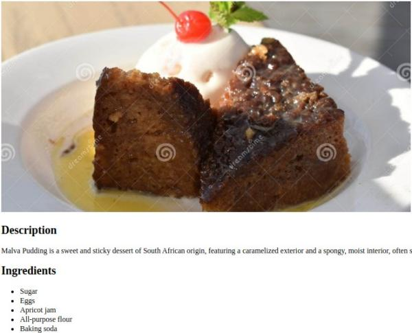
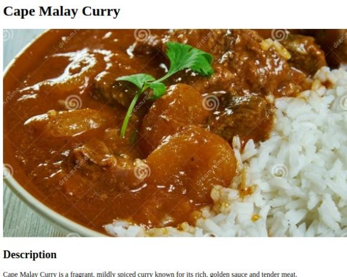
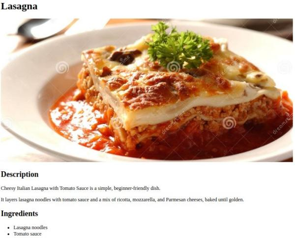

# Odin Recipes

## Introduction
Odin Recipes is a basic recipe website created as part of the Odin Project curriculum. The Odin Project is a comprehensive program for aspiring web developers, and this project aims to demonstrate foundational HTML skills.

## Project Description
This project involves building a minimalist yet functional recipe website. The primary goal is to display an understanding of basic HTML structure and content organization, with a focus on creating a user-friendly and informative site.

## Objective
To practice and enhance HTML coding abilities, particularly in structuring a website and organizing content effectively, without delving into advanced styling or scripting.

## Technologies Used
- HTML (HTML5)

## Project Structure

```
odin-recipes/
│
├── index.html # Main landing page with links to all recipes
├── README.md # This file
|── LICENSE.md # License information
|── img/
│ ├── malva-pudding.jpg
│ ├── lasagna.jpg
│ ├── cape-malay-curry.jpg
│ ├── screen-captures/ # Full-size screen captures of recipe pages
│ │ ├── cape-malay-curry-page.jpg
│ │ ├── lasagna-page.jpg
│ │ ├── malva-pudding-page.jpg
│ ├── screen-captures/medium-thumbnails/ # Medium-size images for README
│ ├── cape-malay-curry-page.jpg
│ ├── lasagna-page.jpg
│ ├── malva-pudding-page.jpg
└── recipes/ # Directory containing individual recipe pages
  ├── lasagna.html # Recipe page for Lasagna
  ├── cape-malay-curry.html # Recipe page for Cape Malay Curry
  └── malva-pudding.html # Recipe page for Malva Pudding
```
## Screenshots

### Malva Pudding
[](img/screen-captures/malva-pudding-page.jpg)
*Malva Pudding recipe page showcasing the description, ingredients, and preparation steps.*

### Cape Malay Curry
[](img/screen-captures/cape-malay-curry-page.jpg)
*Cape Malay Curry recipe page with detailed instructions and ingredient list.*

### Lasagna
[](img/screen-captures/lasagna-page.jpg)
*Classic Lasagna recipe page featuring a step-by-step cooking process.*


## Current Design Philosophy
Adopting a minimalist and brutalist design approach, the website focuses on functionality and straightforwardness. The goal is to present content in a clean and unadorned format, prioritizing ease of navigation and readability. [Learn more about minimalist web design](https://www.google.com/search?q=minimalist+web+design+examples).

## Future Plans
- Incorporate CSS for improved aesthetics and user interface design.
- Implement responsive design for better accessibility on various devices.
- Explore adding interactive elements using JavaScript.

## Reflections and Learnings
- Enhanced knowledge of local and international cuisines through recipe research.
- Utilized HTML validation tools to adhere to web standards, improving code quality.
- Adopted efficient editing practices such as multiple-cursor input.

## How to Contribute
1. Fork the repository.
2. Create a new feature branch (`git checkout -b feature-branch`).
3. Make your changes.
4. Commit your changes (`git commit -am 'Add some feature'`).
5. Push to the branch (`git push origin feature-branch`).
6. Create a new Pull Request.

## Contact
If you have any questions or want to discuss this project, please contact me at [wizzardx@email.com].

## License
Odin Recipes is open source and available under the [MIT License](https://opensource.org/licenses/MIT). For detailed licensing information, see [LICENSE.md](LICENSES.md).
