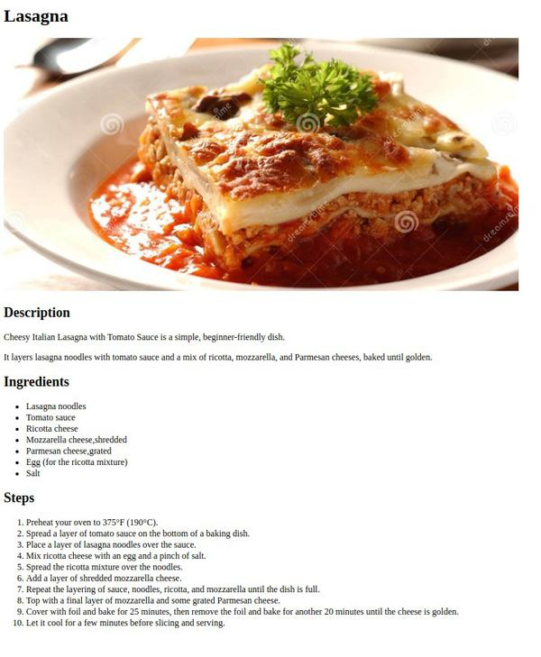
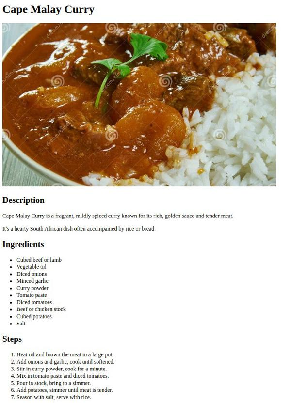
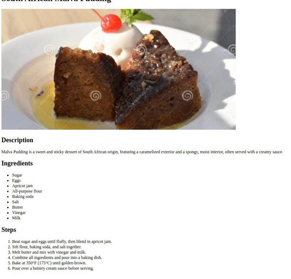

# Odin Recipes

## Introduction
Odin Recipes is a basic recipe website created as part of the Odin Project curriculum. The Odin Project is a comprehensive program for aspiring web developers, and this project demonstrates foundational HTML skills. The recipes were chosen through a search for various cuisines, providing a diverse selection for the project.

## Project Description
This project involves building a minimalist yet functional recipe website. The primary goal is to display an understanding of basic HTML structure and content organization, focusing on creating a user-friendly and informative site.

## Objective
To practice and enhance HTML coding abilities, particularly in structuring a website and organizing content effectively, without delving into advanced styling or scripting. This includes practicing basic HTML elements like links, lists, paragraphs, and images.

## Technologies Used
- HTML (HTML5)

## Project Structure

```
odin-recipes/
│
├── index.html # Main landing page with links to all recipes
├── README.md # This file
|── LICENSE.md # License information
|── img/
│ ├── malva-pudding.jpg
│ ├── lasagna.jpg
│ ├── cape-malay-curry.jpg
│ ├── screen-captures/ # Full-size screen captures of recipe pages
│ │ ├── cape-malay-curry-page.jpg
│ │ ├── lasagna-page.jpg
│ │ ├── malva-pudding-page.jpg
│ ├── screen-captures/medium-thumbnails/ # Medium-size images for README
│ ├── cape-malay-curry-page.jpg
│ ├── lasagna-page.jpg
│ ├── malva-pudding-page.jpg
└── recipes/ # Directory containing individual recipe pages
  ├── lasagna.html # Recipe page for Lasagna
  ├── cape-malay-curry.html # Recipe page for Cape Malay Curry
  └── malva-pudding.html # Recipe page for Malva Pudding
```
## Screenshots

### Lasagna
[](https://raw.githubusercontent.com/wizzardx/odin-recipes/main/img/screen-captures/lasagna-page.jpg)
*Classic Lasagna recipe page featuring a step-by-step cooking process.*

### Cape Malay Curry
[](https://raw.githubusercontent.com/wizzardx/odin-recipes/main/img/screen-captures/cape-malay-curry-page.jpg)
*Cape Malay Curry recipe page with detailed instructions and ingredient list.*

### Malva Pudding
[](https://raw.githubusercontent.com/wizzardx/odin-recipes/main/img/screen-captures/malva-pudding-page.jpg)
*Malva Pudding recipe page showcasing the description, ingredients, and preparation steps.*
## Current Design Philosophy
The website focuses on functionality and straightforwardness, adopting a minimalist design approach. This aligns with the project's focus on basic HTML, as per the Odin Project curriculum guidelines.

## Future Plans
- Follow the Odin Project curriculum for future enhancements in CSS and JavaScript as I progress through the course.

## Reflections and Learnings
- Reinforced foundational HTML skills taught in the curriculum through a practical project.
- Practiced basic HTML elements like links, lists, paragraphs, and images.

## How to Contribute
For graphic design or image editing suggestions to enhance the project's visual appeal, please use the following:
- [Discussions page](https://github.com/wizzardx/odin-recipes/discussions) for discussions about the project.
- [Pull Request page](https://github.com/wizzardx/odin-recipes/pulls) to suggest changes or additions.

## Contact
For contributions or discussions about the project, please use the [discussions page](https://github.com/wizzardx/odin-recipes/discussions). To suggest changes or additions, feel free to make a [pull request](https://github.com/wizzardx/odin-recipes/pulls).

## License
Odin Recipes is open source and available under the [MIT License](https://opensource.org/licenses/MIT). For detailed information on third-party licensing, see [LICENSES.md](LICENSES.md), which contains licensing details for images and other third-party resources used in the project.
